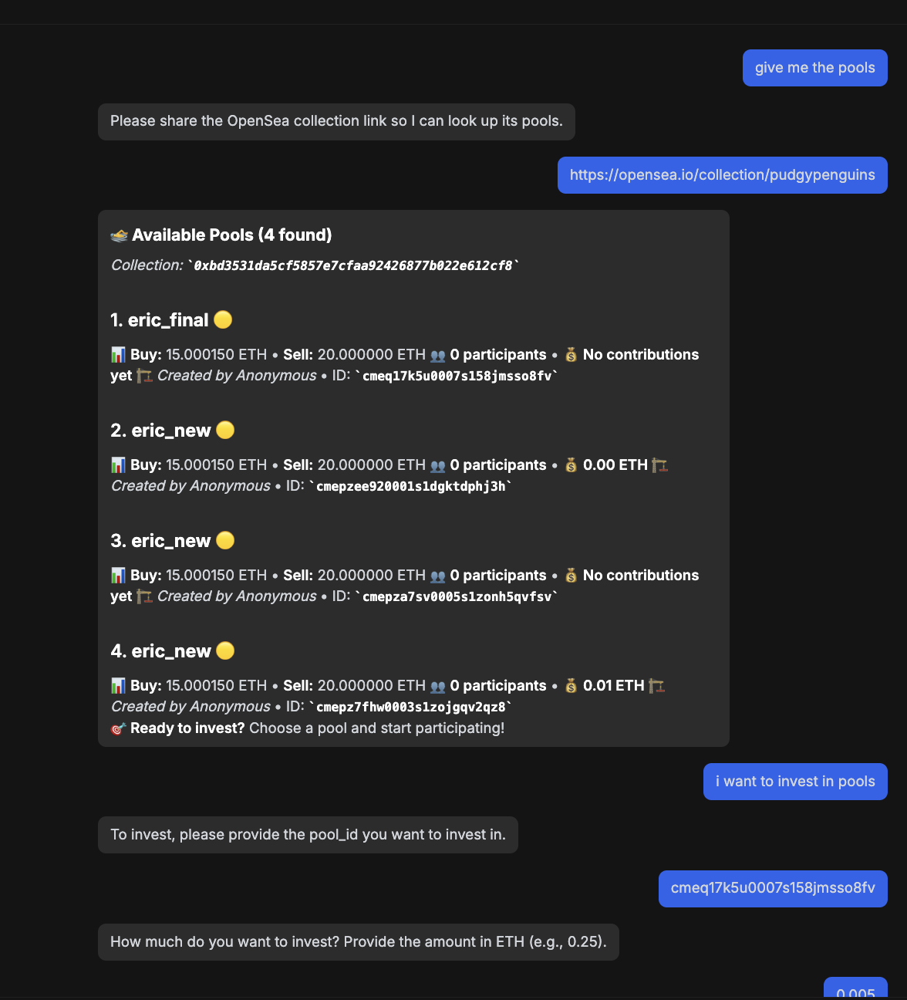
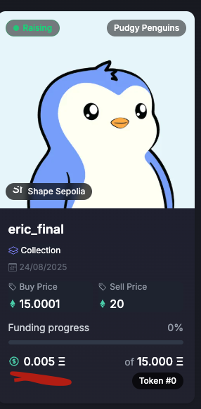

# 🌊 POOLS - AI-Powered NFT Fractional Ownership

## 🎯 Our Mission

At POOLS, our mission is to make NFTs accessible by letting people buy together through fractional ownership. But one challenge we kept facing is how much time it takes to gather interest from multiple users at the same time.

That's why, during the hackathon, we built an AI chatbot that sets up pools for you. Instead of chasing friends or waiting for group chats to move, you can simply tell the AI agent which collection you like. If your budget isn't enough, the AI automatically creates a pool, starts matching you with others and invest for you.

The real goal is to make these AI agents talk to each other. They share demand across the platform, bring in other users, and accelerate the funding process. What used to take hours or days can now happen instantly.

## 🚀 Key Features

- **AI-Powered Pool Creation**: Simply chat with our AI agent to create NFT pools
- **Fractional Ownership**: Buy expensive NFTs together with other users
- **Real-time Investment**: AI agents automatically create pool and invest in it on your behalf
- **Cross-Platform Integration**: Seamless integration with OpenSea and other NFT marketplaces

## 📹 Demo Videos

### Video 1: Wallet Creation & Connection

https://github.com/tribot17/shapecraft_usepools/blob/main/connect_wallet_create.mp4

**What to showcase:**

- User connecting their wallet
- Creating a managed wallet
- Setting up the initial configuration
- Ready to start chatting with AI

### Video 2: AI Chat & Pool Creation

https://github.com/tribot17/shapecraft_usepools/blob/main/chat_pool_creation.mp4

**What to showcase:**

- User chatting with AI about NFT collections
- AI analyzing collection data from OpenSea
- AI suggesting pool creation
- Pool being created on Shape Network

### Video 3: Pool Management & Investment

CF : auto-invest.png and invested.png

**What to showcase:**

- Viewing created pools
- Pool statistics and performance
- Investment tracking
- Fractional ownership tokens

**Available Features (not shown in video):**

- List of pools created by collection by asking list the pool
- Indicate the opensea URL of the collection, for exemple https://opensea.io/collection/roses-are-dead
- Automatic investment via the "invest" command
- Pool management dashboard
- Real-time investment tracking

## 🛠️ Technical Stack

- **Frontend**: Next.js with TypeScript
- **Backend**: Python FastAPI
- **Blockchain**: Shape Network (Ethereum-compatible)
- **AI**: OpenAI GPT-4 Integration
- **Database**: PostgreSQL

## 🔗 Smart Contracts

For this project, we exported our smart contracts from Ethereum to Shape Network.

**Smart Contracts on Shape Network:**

- [Pool Factory Contract](https://sepolia.shapescan.xyz/address/0x7b1B4090fb7bEa28B7E7B08AfE1572AE5CB35098)
- [Fractional Ownership Contract](https://sepolia.shapescan.xyz/address/0x8e0C4fB549f500ED2a20340CeB8BA385A732491D)

## 🎯 How It Works

1. **User Interaction**: Users chat with our AI agent about NFT collections they're interested in
2. **AI Analysis**: The AI analyzes the collection, checks prices, and determines if pooling is beneficial
3. **Pool Creation**: If beneficial, the AI automatically creates a pool for the collection
4. **Investment Execution**: Once the pool reaches the target, the AI automatically invests in the NFT
5. **Fractional Ownership**: Users receive fractional ownership tokens representing their share

## 🔗 Useful Links

- **Live Demo**: [https://shapecraft-usepools.vercel.app/](https://shapecraft-usepools.vercel.app/)
- **Usepools preprod (to see in live created pool and investement)**: [https://usepools-git-preprod-use-pools.vercel.app/profile](https://usepools-git-preprod-use-pools.vercel.app/)

## 📞 Contact

- **Project Link**: [[https://usepools](https://www.usepools.com/))
- **Team**: POOLS Development Team

---

**Built with ❤️ during the hackathon to revolutionize NFT fractional ownership**
